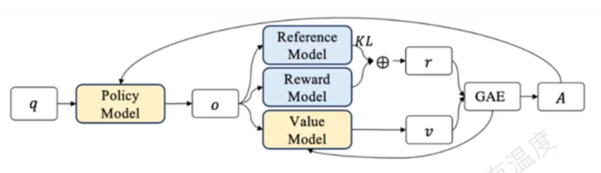
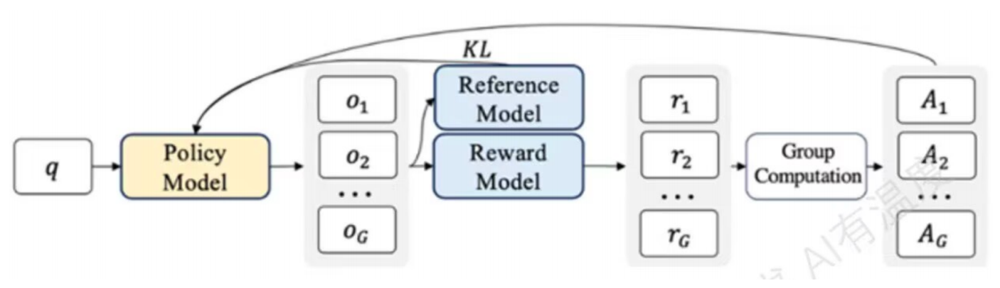

# 算法篇：大模型强化学习算法概览

## 写给读者

由于我所做的科研工作主要集中在强化学习领域，所以在有关强化学习的部分我会多讲点。我是菜鸟，如有错误请多包涵。

首先我会用一个概览的形式帮助大家梳理大模型RL的发展历程，然后再对Minimind实现的强化学习方法进行针对性讲解。

**如果读者对RL不是很熟悉**，建议先观看西湖大学赵世钰老师的课【【强化学习的数学原理】课程：从零开始到透彻理解（完结）】 https://www.bilibili.com/video/BV1sd4y167NS/?share_source=copy_web&vd_source=04a375889e6b661ced59c4e086e9e82d 。如果觉得太难，也可以看看业界大佬王树森老师的课【【2025最新版】王树森深度强化学习全套课程（280集）涵盖PPO算法/DQN算法/A3CQ-Learning/SARSA算法等强化学习经典算法！学完即可就业！】 https://www.bilibili.com/video/BV1hhbSzjEi1/?share_source=copy_web&vd_source=04a375889e6b661ced59c4e086e9e82d 。

另外还可以看看《动手学强化学习》（https://hrl.boyuai.com/），深入浅出，并附带代码实现。

**如果读者已经熟悉了RL**，只是想看看Minimind的RL算法是怎么实现的，可以直接看后面的章节。

**重点：TRPO，PPO，DPO，GRPO**

## 1. 引言：对齐技术的范式转移与推理能力的涌现

随着大语言模型（LLM）参数规模的指数级增长，预训练（Pre-training）阶段赋予了模型海量的世界知识和基础的语言生成能力。然而，仅仅通过预测下一个Token（Next Token Prediction）训练出来的模型，往往缺乏对人类意图的精准理解，且在面对复杂的逻辑推理任务时容易产生幻觉或逻辑断裂。为了解决这一问题，后训练（Post-training）阶段引入了强化学习（Reinforcement Learning, RL），旨在通过奖励信号引导模型生成更符合人类价值观、更具实用性且逻辑更严密的回复。

本报告将系统性地梳理大模型强化学习算法的演进脉络。我们将从经典的**Actor-Critic**范式出发，深入剖析**PPO**及其理论先驱**TRPO**；随后探讨为了解决计算效率问题而诞生的**ReMax**、**RLOO**等**REINFORCE**变体；紧接着，我们将详细解读**DPO**、**IPO**、**KTO**、**ORPO使用隐式奖励模型的**RL-Free**算法；最后，重点分析随着DeepSeek-R1等推理模型爆发而涌现的**GRPO**及其进阶变体（**Dr. GRPO**、**DAPO**、**GSPO**、**SAPO**、**GTPO**），以及过程监督（**PRM**）与自举学习（**STaR）如何共同推动了模型推理能力的提升。

通过对这十余种算法的深度解构，本报告旨在揭示算法迭代背后的数学直觉与工程权衡，为理解当前大模型对齐与推理增强的最前沿技术提供详尽的参考。

## 2. 强化学习在LLM中的基石：信任区域与Actor-Critic架构

强化学习（RL）将大模型从“续写文本的机器”变成了“理解指令并对齐人类价值观的助手”。本章我们将深入探讨支撑这一转变的两大核心算法：理论优美的 TRPO 和工业实战的 PPO。

### 2.1 TRPO：信任区域策略优化的理论奠基

Trust Region Policy Optimization (TRPO) 是现代策略梯度方法的“祖师爷”。虽然现在我们很少直接运行 TRPO 代码来训练大模型，但它是理解 PPO 的必经之路。

#### 2.1.1 核心直觉：步长的艺术

想象你在大雾弥漫的险峻山脊上登山（寻找最优策略）。

- **普通梯度下降**：你看着脚下的坡度，闭着眼迈出一大步。如果步子太大，你可能直接掉下悬崖（策略崩溃，模型开始胡言乱语且无法恢复）。
- **TRPO**：你在脚周围画了一个圈（信任区域），告诉自己：“无论怎么走，我都不能走出这个圈，而且新位置的风景（策略分布）不能和现在差别太大。”

TRPO 的核心不在于限制参数 $\theta$ 变了多少数值，而在于限制**策略的行为**（概率分布）变了多少。我们用 **KL 散度（KL Divergence）** 来衡量这种变化的“距离”。

#### 2.1.2 数学原理与优化目标

TRPO 试图解决一个带约束的优化问题：我们要最大化回报，但前提是新旧策略的差异不能超过阈值 $\delta$。

$$\begin{aligned} \max_{\theta} \quad & \mathbb{E}_{t} \left[ \frac{\pi_{\theta}(a_t|s_t)}{\pi_{\theta_{old}}(a_t|s_t)} A_t \right] \\ \text{subject to} \quad & \mathbb{E}_{t} [ \text{KL}(\pi_{\theta_{old}}(\cdot|s_t) || \pi_{\theta}(\cdot|s_t)) ] \le \delta \end{aligned}$$

- **目标函数**：使用的是“重要性采样”（Importance Sampling），即那个比率 $\frac{\pi_{\theta}}{\pi_{old}}$。
- **约束条件**：KL 散度必须小于 $\delta$（信任区域半径）。

**为什么难以计算？** 为了求解这个约束问题，TRPO 对 KL 散度进行了二阶泰勒展开。这引入了一个巨大的矩阵——**海森矩阵（Hessian Matrix）**。 对于一个 7B 参数的模型，海森矩阵的大小是 $70亿 \times 70亿$。计算并存储它的逆矩阵（$H^{-1}$）在物理上是不可能的。TRPO 使用了 **共轭梯度法（Conjugate Gradient）** 来近似计算 $H^{-1}g$ 向量积，避免了直接存储矩阵，但计算量依然巨大。

#### 2.1.3 算法代码示例 (PyTorch 简化版)

理解 TRPO 的核心在于理解它是如何计算“搜索方向”的。

```python
import torch
import torch.nn as nn
from torch.distributions import Categorical

class TRPO_Concept(nn.Module):
    def __init__(self, policy_net):
        super().__init__()
        self.policy = policy_net

    def get_kl(self, old_dist, new_dist):
        """计算两个策略分布之间的 KL 散度"""
        return torch.distributions.kl.kl_divergence(old_dist, new_dist).mean()

    def trpo_step(self, states, actions, advantages, old_log_probs, max_kl=0.01):
        """
        TRPO 伪代码逻辑演示
        注意：完整实现需要共轭梯度法 (Conjugate Gradient) 来求解 Hx = g
        """
        # 1. 计算当前策略分布
        logits = self.policy(states)
        new_dist = Categorical(logits=logits)
        new_log_probs = new_dist.log_prob(actions)

        # 2. 计算概率比率 (Ratio)
        ratio = torch.exp(new_log_probs - old_log_probs)
        
        # 3. 计算代理目标 (Surrogate Objective)
        loss = -(ratio * advantages).mean()

        # 4. 计算梯度
        grads = torch.autograd.grad(loss, self.policy.parameters(), create_graph=True)
        flat_grads = torch.cat([g.view(-1) for g in grads])

        # --- TRPO 的核心难点 ---
        # 这里的 KL 约束通常需要计算 Hessian-Vector Product (HVP)
        # 然后使用共轭梯度法求解更新方向
        # step_direction = conjugate_gradient(HVP_function, flat_grads)
        
        print("TRPO Step: Calculating step direction subject to KL constraint...")
        # 实际代码会非常长，此处省略复杂的 CG 求解过程
        return loss
```

#### 2.1.4 深度洞察：为什么 LLM 一般不用它？

TRPO 虽然保证了**单调改进（Monotonic Improvement）**——即理论上模型只会变好不会变差——但它太慢了。在 LLM 训练中，数据量和参数量都极大，二阶优化的计算开销是不可接受的。TRPO 的遗产是告诉我们：**“控制步长很重要，但我们需要一种更廉价的方法。”** 这就是 PPO 诞生的契机。

### 2.2 PPO：近端策略优化的工业级标准

Proximal Policy Optimization (PPO) 是 OpenAI 在 2017 年提出的算法。它是目前 RLHF（Reinforcement Learning from Human Feedback）事实上的标准算法。

**一句话总结 PPO**：它用简单的“裁剪（Clipping）”技巧，模拟了 TRPO 的信任区域，同时只使用一阶导数（梯度），计算极其高效。

#### 2.2.1 算法机制：裁剪魔法

PPO 不去解复杂的带约束优化问题，而是直接把约束写进了目标函数里。它定义了一个“被裁剪的目标函数”：

$$ L^{CLIP}(\theta) = \mathbb{E} [ \min(r_t(\theta) \hat{A}_t, \text{clip}(r_t(\theta), 1-\epsilon, 1+\epsilon) \hat{A}_t) ] $$

这个公式看起来吓人，其实逻辑非常简单朴素：

1. $r_t(\theta)$ **是什么？** 它是新策略和旧策略的比值。如果 $r_t=1$，说明策略没变。
2. $\epsilon$ **是什么？** 这是一个超参数，通常设为 0.2。意味着我们允许新策略比旧策略强 20% 或弱 20%，但不能更多。
3. **核心逻辑：**
   - 如果这个动作是**好动作**（优势 $A_t > 0$）：我们希望增加这个动作的概率。但是，**别增加太多**！如果 $r_t$ 超过了 $1.2$，我们就把它截断按 $1.2$ 算。这防止了模型过度自信地修改策略。
   - 如果这个动作是**坏动作**（优势 $A_t < 0$）：我们希望减少概率。同样，**别减少太多**！如果 $r_t$ 低于 $0.8$，按 $0.8$ 算。防止模型彻底放弃探索某个可能性。

#### 2.2.2 工业级PPO架构：四个模型

在 LLM 的 RLHF 训练（如 Training GPT-3/4）中，PPO 不仅仅是一个公式，而是一套复杂的系统架构。为了保证训练稳定，我们需要在显存中同时维护**四个模型**。



1. **Actor (策略模型** $\pi_\theta$**)**：主角。即我们要训练的 LLM。它负责根据 Prompt 生成 Token。**它是可训练的。**
2. **Critic (价值模型** $V_\phi$**)**：军师。它不生成文本，只负责预测：“按照现在这个写法，最后能得多少分？”它帮助减少方差。**它是可训练的。**
3. **Reference Model (**$\pi_{ref}$**)**：老师。它是 SFT 阶段后的模型副本，**参数冻结**。它的作用是作为锚点，计算 KL 散度，防止 Actor 为了刷高分而学会说怪话（Reward Hacking）。
4. **Reward Model (RM)**：裁判。它基于人类偏好训练而来，**参数冻结**。它给 Actor 生成的整段话打分。

#### 2.2.3 PPO 核心伪代码实现 (PyTorch)

这是 PPO 最精华的部分:损失函数的计算。

```python
import torch
import torch.nn as nn
import torch.nn.functional as F

class PPOTrainer:
    def __init__(self, clip_epsilon=0.2):
        self.clip_epsilon = clip_epsilon

    def compute_loss(self, old_log_probs, new_log_probs, advantages, returns, values):
        """
        计算 PPO 的总损失函数
        :param old_log_probs: 旧策略下动作的对数概率 (不再更新，detached)
        :param new_log_probs: 当前 Actor 生成的对数概率 (需要梯度)
        :param advantages: 优势函数 A_t
        :param returns: 真实回报 (Rewards + Gamma * V_next)
        :param values: Critic 预测的价值 V(s)
        """
        
        # 1. 计算概率比率 r_t
        # exp(new - old) 等价于 new / old
        ratio = torch.exp(new_log_probs - old_log_probs)
        
        # 2. 计算未裁剪的损失 (Surrogate 1)
        surr1 = ratio * advantages
        
        # 3. 计算裁剪后的损失 (Surrogate 2)
        # torch.clamp 将 ratio 限制在 [1-eps, 1+eps] 范围内
        ratio_clipped = torch.clamp(ratio, 1.0 - self.clip_epsilon, 1.0 + self.clip_epsilon)
        surr2 = ratio_clipped * advantages
        
        # 4. PPO Actor Loss: 取两者的最小值，然后取负号(因为是梯度下降)
        policy_loss = -torch.min(surr1, surr2).mean()
        
        # 5. Critic Loss: 均方误差 (MSE)
        # 希望 Critic 预测的 value 越接近真实的 returns 越好
        value_loss = F.mse_loss(values, returns)
        
        # 6. 总损失 = Policy Loss + Value Coefficient * Value Loss
        # 甚至通常还会加上 Entropy Loss 来鼓励探索
        total_loss = policy_loss + 0.5 * value_loss
        
        return total_loss

# 示例调用
# 假设我们有一批数据
clip_epsilon = 0.2
trainer = PPOTrainer(clip_epsilon)
# data = rollout_buffer.sample() ... 
# loss = trainer.compute_loss(...)
# loss.backward()
```

#### 2.2.4 PPO 的隐忧：显存墙与生成瓶颈

虽然 PPO 被广泛采用，但它在千亿参数时代面临巨大挑战：

1. **显存墙 (Memory Wall)**：
   - 看上面的架构，你需要加载 **4 个大模型**。
   - **解决方案**：通常使用 LoRA（仅微调 Actor/Critic 的少量参数）或卸载技术（Offloading）来缓解，或者让 Critic 和 Reward Model 共享部分权重。
2. **生成瓶颈 (Generation Bottleneck)**：
   - PPO 是 **On-Policy** 算法。这意味着每训练一步，Actor 必须现场生成新的文本（Rollout）。
   - LLM 的生成（推理）速度远慢于训练速度。在 PPO 训练中，**90% 的时间可能都花在让模型生成文本上**，只有 10% 的时间在做梯度更新。

尽管如此，PPO 凭借其强大的稳定性，依然是目前训练高质量对话模型（如 ChatGPT, Claude）的首选方案。

------

## 3 效率至上：去除 Critic 的 REINFORCE 类算法

PPO 的沉重负担引发了业界的反思：在 LLM 的微调场景下，我们真的需要一个复杂的 Critic 网络来估计价值吗？不同于玩 Atari 游戏或机器人控制，LLM 的环境（Prompt）是一次性的，且状态转移是确定性的（Deterministic Transitions）。这使得**REINFORCE**类算法的改进版重新回到了舞台中心。

### 3.1 ReMax：利用确定性环境的方差缩减

**ReMax** 针对 PPO 的 Critic 冗余问题，提出了一种极简的方差缩减技巧。其核心洞察是：LLM 生成文本的过程虽然是随机采样的，但 Prompt 本身是不变的。我们可以利用这种性质来构造一个无偏且低方差的基线（Baseline） 。

**算法流程：**

1. 对于给定的 Prompt $x$，模型首先进行一次随机采样，得到回复 $y_{sample}$。

2. 对于同一个 Prompt，模型再进行一次**贪婪解码（Greedy Decoding）**，得到回复 $y_{greedy}$。

3. 计算两个回复的奖励差值作为优势估计：

   $$A(x, y_{sample}) = R(x, y_{sample}) - R(x, y_{greedy})$$

4. 使用这个优势值进行标准的 REINFORCE 更新。

**深度解析：** ReMax 不需要训练额外的 Value Model（Critic），直接砍掉了 1/4 到 1/2 的显存占用。由于 $y_{greedy}$ 是模型当前认为“最好”的输出，将其作为基线非常合理：比贪婪结果好，就奖励；比贪婪结果差，就惩罚。实验表明，ReMax 仅需几行代码即可实现，且在 Llama-2-7B 等模型上的效果与 PPO 持平，但训练速度快得多 。

### 3.2 RLOO：留一法基线 (REINFORCE Leave-One-Out)

当我们可以对同一个 Prompt 采样多个回复（例如 $K=4$ 或 $K=8$）时，**RLOO** 提供了一种比 ReMax 更高效的基线计算方法 。

**核心机制：**

RLOO 不依赖额外的贪婪解码，而是利用同一批次（Batch）内的其他采样样本来构造基线。对于第 $i$ 个采样回复 $y_i$，其基线 $b_i$ 计算为其余 $K-1$ 个回复奖励的平均值：

$$b_i = \frac{1}{K-1} \sum_{j \neq i} R(x, y_j)$$

优势估计则为：$A_i = R(x, y_i) - b_i$。

**比较优势：**

- **计算效率**：相比 ReMax 需要额外的一次推理（贪婪解码），RLOO 充分利用了探索性采样的数据。
- **无偏性**：RLOO 提供的梯度估计在统计上是无偏的，且随着采样数 $K$ 的增加，方差显著降低。Cohere 的研究指出，RLOO 在很多场景下能够超越 PPO，且实现难度大幅降低 。

### 3.3 Reinforce++：工程技巧的集大成者

**Reinforce++** 并非一个全新的理论突破，而是一个重要的工程发现。研究人员发现，PPO 优于传统 REINFORCE 的原因往往不在于 Critic 本身，而在于 PPO 引入的一系列工程技巧，如：

- **Token 级 KL 惩罚**（而不是整个序列）。
- **梯度裁剪（Gradient Clipping）**。
- **优势归一化（Advantage Normalization）**。

Reinforce++ 将这些技巧反向移植回 REINFORCE 算法。结果令人惊讶：在去除 Critic 的情况下，Reinforce++ 能够达到甚至超过 PPO 的稳定性。这进一步证实了在 LLM 对齐中，Critic 可能是一个“由于历史惯性而被保留的累赘” 。

------

## 4. RL-Free：从显式奖励到隐式偏好

虽然去除了 Critic，但 ReMax 和 RLOO 依然需要一个显式的 **Reward Model**。训练一个高质量的 Reward Model 本身就极具挑战，且容易出现“奖励黑客”（Reward Hacking）现象。如果能跳过 RM，直接用人类偏好数据优化 Policy，岂不更美？这一思想引发了 **DPO** 及其衍生算法的爆发。

### 4.1 DPO：直接偏好优化 (Direct Preference Optimization)

**DPO** 的提出被视为 LLM 对齐领域的一个分水岭。它基于一个深刻的数学推导：在 RLHF 的最优解形式中，奖励函数 $r(x,y)$ 和最优策略 $\pi^*(y|x)$ 存在严格的对偶关系 。

#### 4.1.1 数学推导与核心公式

（其实想在代码中使用DPO的话也不用把这些推导都搞懂，记住最后的loss公式也能用）

DPO (Direct Preference Optimization) 的核心思想是将传统的强化学习问题转化为一个分类问题。其推导过程可以分为三个关键步骤：从 RLHF 的目标函数出发，解出最优策略的形式，最后消去无法计算的配分函数。

##### 1. 传统的 RLHF 目标函数

在 RLHF 阶段，我们的目标是训练一个策略 $\pi$（即 LLM），使其生成的回答能最大化奖励模型 $r(x,y)$ 的预期值，同时为了防止模型崩溃（hacking），我们需要约束它与参考模型 $\pi_{ref}$ 之间的 KL 散度。

数学表达为：

$$\max_{\pi} \mathbb{E}_{x \sim D, y \sim \pi} \left[ r(x,y) - \beta D_{KL}(\pi(y|x) || \pi_{ref}(y|x)) \right]$$

其中，$\beta$ 是控制 KL 惩罚力度的超参数。

##### 2. 最优策略的解析解

数学上可以证明，上述受约束的优化问题存在一个闭式解（Closed-form solution）。最优策略 $\pi^*$ 必然满足以下形式：

$$\pi^*(y|x) = \frac{1}{Z(x)} \pi_{ref}(y|x) e^{\frac{1}{\beta} r(x,y)}$$

这里，$Z(x) = \sum_y \pi_{ref}(y|x) e^{\frac{1}{\beta} r(x,y)}$ 是一个配分函数（Partition Function），用于保证概率归一化。由于需要对所有可能的 $y$ 求和，**$Z(x)$ 在计算上是不可行的**。

##### 3. 巧妙的重参数化（消去 Z(x)）

DPO 的精髓在于“反向思考”：如果我们假设当前的策略就是最优策略 $\pi^*$，我们可以通过对数变换，反解出奖励函数 $r(x,y)$。

对最优策略公式两边取对数并移项：

$$\begin{aligned} \log \pi^*(y|x) &= \log \pi_{ref}(y|x) + \frac{1}{\beta}r(x,y) - \log Z(x) \\ \frac{1}{\beta}r(x,y) &= \log \frac{\pi^*(y|x)}{\pi_{ref}(y|x)} + \log Z(x) \\ r(x,y) &= \beta \log \frac{\pi^*(y|x)}{\pi_{ref}(y|x)} + \beta \log Z(x) \end{aligned}$$

现在，我们将这个 $r(x,y)$ 代入 Bradley-Terry 偏好模型。Bradley-Terry 模型认为，人类选择 $y_w$（胜者）优于 $y_l$（败者）的概率取决于两者的奖励差值：

$$P(y_w \succ y_l | x) = \sigma(r(x,y_w) - r(x,y_l))$$

当我们计算奖励差值 $r(x,y_w) - r(x,y_l)$ 时，**仅与 $x$ 有关的项 $\beta \log Z(x)$ 会自动相减抵消**：

$$\begin{aligned} r(x,y_w) - r(x,y_l) &= \left( \beta \log \frac{\pi^*(y_w|x)}{\pi_{ref}(y_w|x)} + \bcancel{\beta \log Z(x)} \right) - \left( \beta \log \frac{\pi^*(y_l|x)}{\pi_{ref}(y_l|x)} + \bcancel{\beta \log Z(x)} \right) \\ &= \beta \log \frac{\pi^*(y_w|x)}{\pi_{ref}(y_w|x)} - \beta \log \frac{\pi^*(y_l|x)}{\pi_{ref}(y_l|x)} \end{aligned}$$

##### 4. DPO 损失函数

通过上述步骤，我们将无法计算的 $Z(x)$ 和显式的奖励函数 $r(x,y)$ 全部消除，直接用策略网络 $\pi_\theta$ 的概率比值来定义损失函数。

最终的 DPO 损失函数为标准的负对数似然损失：

$$L_{DPO}(\pi_\theta; \pi_{ref}) = - \mathbb{E}_{(x, y_w, y_l) \sim D} \left[ \log \sigma \left( \beta \log \frac{\pi_\theta(y_w|x)}{\pi_{ref}(y_w|x)} - \beta \log \frac{\pi_\theta(y_l|x)}{\pi_{ref}(y_l|x)} \right) \right]$$

这个公式的物理含义非常直观：**增加“好回答”相对于参考模型的概率比重，同时降低“坏回答”的概率比重。**

#### 4.1.2 DPO 的战略意义与局限

- **稳定性**：DPO 将 RL 问题转化为了一个标准的**监督学习（Supervised Learning）**问题（实际上是二分类）。它极其稳定，不需要采样，不需要 4 个模型（只需 Actor 和 Ref），显存极其友好。
- **局限**：
  - **分布偏移（Distribution Shift）**：DPO 是离线（Offline）算法。如果偏好数据集中的回复分布与模型当前的生成能力差异过大，DPO 的效果会打折扣。
  - **模式坍塌**：实验表明 DPO 容易导致输出多样性下降。
  - **缺乏探索**：由于没有在线采样，DPO 无法发现数据集中未出现的“更好解” 。

**推荐视频**

对于这一推导过程，如果你想看更详细的逐行板书演示，推荐观看下面这个视频，它非常清晰地展示了从 KL 约束到 $Z(x)$ 消除的全过程：

[Direct Preference Optimization (DPO) explained: math derivation](https://www.youtube.com/watch?v=hvGa5Mba4c8)

该视频详细推导了 DPO 损失函数，涵盖了 Bradley-Terry 模型以及如何通过对数概率比率消除配分函数 $Z(x)$，非常适合深入理解其数学原理。

后续的文档还有详细的代码讲解，没看懂的话没关系。

### 4.2 IPO：身份偏好优化 (Identity Preference Optimization)

**IPO** 的提出是为了修正 DPO 在正则化方面的潜在缺陷。DPO 本质上是在最大化偏好数据的似然，这在理论上可能导致过拟合，特别是当 KL 散度约束失效时。

IPO 引入了一种更直接的正则化手段。其损失函数不再通过 Sigmoid 函数试图无限拉大 $y_w$ 和 $y_l$ 的差距，而是让这种差距回归到一个固定的目标值。

$$L_{IPO} = \mathbb{E}_{(x, y_w, y_l)} \left[ \left( \log \frac{\pi(y_w|x)}{\pi_{ref}(y_w|x)} - \log \frac{\pi(y_l|x)}{\pi_{ref}(y_l|x)} - \frac{\gamma}{2} \right)^2 \right]$$

**深度洞察：** IPO 通过均方误差（MSE）来控制更新幅度，避免了 DPO 在某些极端情况下为了微小的偏好差异而大幅破坏模型语言能力的倾向。实证研究显示，IPO 在防止过拟合方面表现更优，但收敛速度可能稍慢 。

### 4.3 KTO：卡尼曼-特沃斯基优化 (Kahneman-Tversky Optimization)

无论是 PPO 还是 DPO/IPO，都需要**成对（Pairwise）**数据（即 $(y_w, y_l)$）。然而，在真实世界中，获得“点状”反馈（例如用户给某个回答点了赞或踩）要比获得“A 比 B 好”的比较数据容易得多。

**KTO** 灵感来源于行为经济学中的**前景理论（Prospect Theory）**，即人类对“收益”和“损失”的感知是不对称的（损失厌恶） 。

**核心机制：**

KTO 不需要配对数据。它定义了一个价值函数，如果一个样本是“Desirable”（点赞），就增加其相对于 $\pi_{ref}$ 的权重；如果是“Undesirable”（点踩），就降低其权重。关键在于，KTO 引入了类似前景理论的非对称加权，使得模型对“避免生成坏结果”的敏感度高于“生成好结果”。

$$L_{KTO} \approx \text{WeightedLoss}(y_{good}) + \lambda \cdot \text{WeightedLoss}(y_{bad})$$

**应用价值：** KTO 的出现打破了偏好数据集的构建瓶颈。在 1B 到 30B 参数规模的实验中，KTO 在仅使用二元信号的情况下，效果匹敌甚至超越了使用配对数据的 DPO。这使得利用大规模用户日志进行持续学习成为可能 。

### 4.4 ORPO：赔率比偏好优化 (Odds Ratio Preference Optimization)

**ORPO** 提出了一种更加激进的思路：为什么我们要在 SFT 之后再单独做一个对齐阶段？能不能将 SFT 和 Alignment 合二为一？

ORPO 观察到，标准的交叉熵损失（SFT Loss）虽然能教模型“怎么说话”，但不能教模型“区分好坏”。ORPO 在 SFT 损失的基础上，增加了一个基于**赔率比（Odds Ratio）**的惩罚项 。

- **赔率（Odds）**：定义为生成某个回复的概率 $P$ 与不生成它的概率 $1-P$ 之比。
- **目标**：最大化“胜出回复”的赔率与“落败回复”的赔率之比。
- **Reference-Free**：ORPO 不需要参考模型 $\pi_{ref}$，这进一步减少了训练时的内存开销。
- **效果**：ORPO 在资源受限或需要快速迭代的场景下极具优势，它证明了在微调阶段早期引入偏好信号可以获得更好的对齐效果。

------

## 5. 群体相对策略优化：DeepSeek 与推理能力的觉醒

进入 2024-2025 年，随着 **DeepSeek-V3/R1** 和 **Qwen2.5-Math** 等模型的发布，强化学习的焦点从“对齐人类价值观”转向了“增强复杂推理能力”。这一转变催生了基于**群体相对（Group Relative）**的优化算法，它们在数学和代码任务上展现了惊人的效果。

### 5.1 GRPO：群体相对策略优化 (Group Relative Policy Optimization)

GRPO (Group Relative Policy Optimization) 是由 DeepSeek 团队在 **DeepSeekMath** 论文中首次提出，并在 **DeepSeek-R1** 的训练中起到决定性作用的核心算法。

它不仅仅是 PPO 的一个变体，更是一次**强化学习范式的变革**。GRPO 成功证明了：在超大规模语言模型的强化学习（RL）阶段，我们其实**不需要**一个庞大的价值网络（Critic Model/Value Model）来指导训练。

#### 5.1.1 背景：传统 PPO 的高训练成本

在传统的 PPO（Proximal Policy Optimization）中，为了评估策略的好坏，我们需要维护四个模型（或者至少占用四份显存逻辑）：

1. **Actor（演员）**：正在训练的模型。
2. **Critic（评论家）**：估算当前状态价值（Value Function）的模型。
3. **Ref（参考模型）**：用于计算 KL 散度，防止模型跑偏。
4. **Reward（奖励模型）**：给结果打分。

对于像 DeepSeek-V3/R1 这样拥有 671B 参数的 MoE 模型，**Critic 模型通常需要和 Actor 模型具备同等量级的参数规模**才能准确估值。这意味着训练成本和显存占用几乎翻倍，且 Actor 和 Critic 之间的梯度通信会造成巨大的工程瓶颈。

**GRPO 的核心洞见在于：** 如果我们一次生成一组回答，就可以通过比较它们内部的优劣来估算“优势”，从而彻底删掉 Critic 模型。

#### 5.1.2 核心机制：以群为镜 (Group as Baseline)



GRPO 的工作流程可以概括为“**群体采样，组内竞争**”。它不再依赖 Critic 预测的绝对分数，而是看一个样本在“同伴”中表现如何。

**算法详细步骤：**

1. **群体采样 (Group Sampling)**：

   对于每一个输入的问题（Prompt）$q$，模型 $\pi_{\theta}$ 并不只生成一个回答，而是并行采样一组回答（比如 $G=64$ 个）：

   $$\{o_1, o_2, ..., o_G\} \sim \pi_{\theta}(o|q)$$

2. **奖励计算 (Reward Calculation)**：

   对这 $G$ 个输出分别计算奖励值 $r_i$。在 DeepSeek-R1 的场景中，这个奖励主要由两部分组成：

   - **准确性奖励**：数学题做对了吗？代码跑通了吗？（离散的 0 或 1）。
   - **格式奖励**：是否按要求使用了 `<think>` 标签？（强制模型进行思考）。
   - *注：这里不需要神经网络奖励模型，仅靠规则（Rule-based）即可。*

3. **优势估计 (Advantage Estimation) —— 核心数学变换**：

   这是 GRPO 的灵魂。传统的优势函数是 $A = r - V(s)$，其中 $V(s)$ 由 Critic 预测。

   GRPO 直接用这就组数据的**平均值**作为基线（Baseline）。第 $i$ 个回答的优势 $A_i$ 计算如下：

   $$A_i = \frac{r_i - \text{mean}(\{r_1, ..., r_G\})}{\text{std}(\{r_1, ..., r_G\}) + \epsilon}$$

   - **解释**：这是一个标准的 Z-Score 标准化。如果一个回答的得分高于组平均值，$A_i$ 就是正的（哪怕大家都很烂，你没那么烂，你也是正的）；反之则是负的。

4. **目标函数更新**：

   计算出优势 $A_i$ 后，GRPO 使用与 PPO 相同的 Clipped Objective 进行更新，同时引入 KL 散度项来约束模型突变：

   $$L_{GRPO} = \mathbb{E} \left[ \min \left( \frac{\pi_\theta}{\pi_{old}} A_i, \text{clip}\left( \frac{\pi_\theta}{\pi_{old}}, 1-\epsilon, 1+\epsilon \right) A_i \right) \right] - \beta D_{KL}(\pi_\theta || \pi_{ref})$$

#### 5.1.3 为什么 GRPO 能引发“顿悟”？

DeepSeek-R1-Zero 在训练过程中出现了令人惊讶的“顿悟时刻”（Aha Moment），即模型学会了自我反思、验证和长链条推理。GRPO 在其中功不可没：

1. **相对优势激发探索**：

   在训练初期，模型处理难题时可能全都会做错（得分为 0）。但在 GRPO 的机制下，只要有一个回复偶然出现了一点点推理的苗头（比如格式更规范，或者步骤更接近答案），它的相对分数就会高于其他回复。

   - **例子**：64 个回答全错，但第 5 个回答写了 100 字推导，其他只写了 10 字。虽然最终答案都错，但第 5 个可能获得微弱的相对正分。GRPO 会敏锐地捕捉到这个信号，鼓励模型“多写推导”。

2. **摆脱了 Reward Model 的偏见**：

   传统的 RLHF 依赖一个神经网络 Reward Model，这个 Reward Model 本身就是有缺陷的（可能会被 hack）。GRPO 直接对接**最终真值（Ground Truth）**（如编译器输出、数学答案）。这种硬性的、客观的反馈强迫模型必须学会真正的逻辑，而不是去讨好奖励模型。

#### 5.1.4 工程与资源优势

对于工业界而言，GRPO 的意义在于显著降低了训练门槛：

- **去掉了 Critic**：直接节省了约 **50% 的显存占用**。这使得 DeepSeek 能够在不增加硬件的情况下，对 671B 这样巨大的模型进行全参数强化学习。
- **并行效率提升**：生成 $G$ 个样本的过程可以高度并行化，且计算组均值和方差的开销极低。
- **训练稳定性**：使用组平均值作为 Baseline，比起训练一个不稳定的 Critic 网络，能够有效减少方差（Variance），让训练曲线更加平滑。

------

## 6. 群体优化的进阶：修正偏差与稳定训练

虽然 GRPO 取得了巨大成功，但随后的研究（如 Dr. GRPO, DAPO, GSPO 等）指出了其在统计学和训练稳定性上的缺陷，并提出了针对性的改进。这是当前 RL 研究最活跃的前沿领域。

**推荐文献：**

https://hugging-face.cn/blog/NormalUhr/grpo-to-dapo-and-gspo

### 6.1 Dr. GRPO：修正统计偏差

**Dr. GRPO (Group Relative Policy Optimization Done Right)** 深入分析了 GRPO 的优势估计公式，发现了三个关键偏差 ：

1. **基线偏差（Baseline Bias）**：使用包含自身的样本均值作为基线是有偏的。Dr. GRPO 建议使用类似 RLOO 的“留一均值”来修正。
2. **长度偏差（Length Bias）**：GRPO 将序列级优势 $A_i$ 分配给序列中的每一个 Token。如果不加归一化，长回复会累积更多的梯度，导致模型倾向于生成极长或极短的回复（取决于优势的正负）。
3. **难度偏差（Difficulty Bias）**：通过标准差归一化优势，会强制拉平简单问题和困难问题的梯度贡献。但这并不合理——简单问题（全对）和极难问题（全错）提供的学习信号应当较弱，而处于“学习区”的问题应当提供更强的信号。Dr. GRPO 引入了**历史感知锚点（History-Aware Anchor）**和**自适应重加权**来解决这一问题。

### 6.2 DAPO：解耦裁剪与动态采样

**DAPO (Decoupled Clip and Dynamic Sampling Policy Optimization)** 由 Verl 框架团队提出，并在 AIME 2024 榜单上取得了 SOTA 成绩。它主要针对大规模 RL 中的效率和死锁问题 。

#### 6.2.1 Clip-Higher：非对称探索

传统的 PPO/GRPO 使用对称的裁剪范围 $[1-\epsilon, 1+\epsilon]$。DAPO 发现，在推理任务中，我们希望模型尽可能多地探索高奖励区域。因此，DAPO **放宽了上限裁剪阈值**，允许优秀的回复产生更大的梯度更新。这种非对称设计有效防止了“熵坍塌”（Entropy Collapse），即防止模型过早收敛到单一解。

#### 6.2.2 动态采样 (Dynamic Sampling)

在训练后期，大量简单的 Prompt 模型已经能 100% 做对，此时组内方差为 0，优势为 0，这些样本不仅不提供梯度，还浪费计算资源。DAPO 引入动态采样机制，实时监控每个 Prompt 的组内方差，**自动过滤掉全对或全错的 Prompt**，确保持续给模型提供有区分度的“有效样本”，极大地提升了样本效率 。

### 6.3 GSPO：序列级稳定性与 MoE 适配

**GSPO (Group Sequence Policy Optimization)** 是 Qwen 团队针对混合专家模型（MoE）训练提出的改进。

**痛点分析：** GRPO 使用 Token 级的裁剪（Token-level Clipping）。但在长链条推理中，某个 Token 的概率比率可能会因为采样的随机性而剧烈波动。对于 MoE 模型，由于不同 Token 可能路由到不同专家，这种波动会被进一步放大，导致 Token 级的梯度更新极其嘈杂且不连贯 。

**解决方案：**

GSPO 将优化的粒度从 Token 提升到了 **Sequence（序列）**。

- 它计算整个序列的联合概率比率。
- 在序列级别应用 Clip 操作。 这保证了对于同一个回复中的所有 Token，要么都更新，要么都被 Clip。这种**一致性（Coherence）**对于保持长链条逻辑的完整性至关重要。实验数据显示，GSPO 在训练 Qwen3 等 MoE 模型时表现出极高的稳定性，而 GRPO 则容易崩溃 。

### 6.4 SAPO：软门控与连续信任区域

**SAPO (Soft Adaptive Policy Optimization)** 进一步反思了“裁剪”这个动作本身。硬裁剪（Hard Clipping）是一个非连续的操作：一旦越界，梯度突然截断为 0。

SAPO 提出用**软门控（Soft Gating）**来替代硬裁剪 。

- **机制**：使用 Sigmoid 或 $\text{sech}^2$ 函数构建一个平滑的衰减系数 $g_t$。

- **自适应温度**：根据优势的正负，SAPO 动态调整门控的温度参数（Temperature）。对于正优势（好结果），允许更大的偏差；对于负优势，施加更严格的约束。

- **公式概览**：$L_{SAPO} = - g_t \cdot A_t$。

  SAPO 构建了一个连续的信任区域，既保留了 GSPO 的序列连贯性，又具备了 Token 级的细粒度调节能力，被证明在 Qwen3-VL 等多模态模型训练中效果显著。

### 6.5 GTPO：熵作为奖励的深层逻辑

**GTPO (Group Token Policy Optimization)** 提出了一个极具哲学意味的假设：在推理过程中，模型在关键决策点（Pivotal Junctures）的“不确定性”不仅不应被惩罚，反而应该被利用 。

- **直觉**：当人类在解题时遇到分岔路口，往往需要更多的认知努力，这在模型中表现为策略熵（Policy Entropy）的升高。
- **机制**：GTPO 将策略熵作为一个动态奖励信号。
  - 对于**成功**的回复，如果某个 Token 的熵高，说明模型在这里“冒险”尝试并成功了，应该给予额外的**熵奖励**（Entropy Bonus）。
  - 对于**失败**的回复，如果熵低（盲目自信），则给予更大的惩罚。
- **GRPO-S**：这是 GTPO 的序列级版本，利用序列平均熵来调整优势。实验表明，这种方法能有效防止模型退化为单一的记忆模式，显著提升了 Pass@K 的上限。

------

## 7. 过程监督与自举：超越结果的反馈

上述算法大多基于结果监督（Outcome Supervision），即只在回复结束时给一个总分。但在长达数千 Token 的推理过程中，究竟是哪一步做对了？哪一步做错了？这就是**信用分配（Credit Assignment）**难题。

### 7.1 PRM：过程奖励模型 (Process Reward Model)

**PRM** 的核心在于提供密集的反馈信号 。

- **PRM vs ORM**：ORM（Outcome Reward Model）只看结果，PRM 就像老师批改作业一样，对推理的每一步（Step-by-step）进行打分。
- **训练挑战**：PRM 通常需要昂贵的人工标注数据（如 MathShepherd 数据集），或者使用蒙特卡洛树搜索（MCTS）生成的合成数据。
- **作用**：在强化学习中，PRM 提供了密集的奖励信号，极大地加速了复杂推理任务的收敛。即使在 DeepSeek-R1 这种主要依赖 GRPO 的模型中，PRM 在推理时的重排序（Re-ranking）和引导搜索（Guided Search）中依然具有不可替代的价值 。

### 7.2 STaR：自举推理 (Self-Taught Reasoner)

**STaR** 代表了另一种“左脚踩右脚”的自进化思路 。

**核心循环：**

1. **生成**：模型尝试解答一批题目。
2. **过滤**：筛选出最终答案正确的样本。
3. **微调**：在这些正确样本上微调模型。
4. **合理化（Rationalization）**：对于做错的题，给定正确答案作为提示（Hint），让模型反推推理过程。如果反推成功，这些数据也加入训练集。

STaR 证明了，只要有一个哪怕很弱的验证器（如答案检查器），模型就可以通过不断学习自己的“成功经验”和“反思修正”来实现推理能力的指数级跃升。这正是 DeepSeek-R1-Zero 能够在没有任何 SFT 数据的情况下，仅靠 RL 涌现出推理能力的核心逻辑。

------

## 8. 总结与展望

回顾从 PPO 到 GRPO/SAPO 的演进历程，我们可以清晰地看到大模型强化学习的趋势：

1. **去繁就简**：Critic 网络因其沉重的计算负担和不稳定性正逐渐退出历史舞台。基于群体统计的基线估计（Group Baseline）已被证明是高效且鲁棒的替代方案（GRPO, RLOO）。
3. **粒度精细化**：从整句奖励到 GSPO/SAPO 的序列/Token 级门控，再到 GTPO 的熵权奖励，RL 正在尝试更精准地告诉模型“哪里想对了，哪里想错了”。

**不同算法的比较概览：**

| **算法**  | **是否需要 Critic** | **显存占用** | **适用场景**          | **核心优势**                              |
| --------- | ------------------- | ------------ | --------------------- | ----------------------------------------- |
| **PPO**   | 是                  | 极高         | 通用 RLHF，机器人控制 | 在线探索，理论成熟，极其稳定              |
| **ReMax** | 否                  | 中           | LLM 微调              | 极简实现，去 Critic，效果持平 PPO         |
| **DPO**   | 否                  | 低           | 通用对话，指令跟随    | 极其稳定，实现简单，无采样开销            |
| **ORPO**  | 否                  | 极低         | SFT+RL 一步到位       | 训练速度快，显存最友好                    |
| **GRPO**  | 否                  | 中低         | **数学/代码推理**     | 适合大规模采样，自适应基线，DeepSeek 首选 |
| **GSPO**  | 否                  | 中低         | **MoE/长文本**        | 序列级一致性，防止长链条崩塌              |
| **DAPO**  | 否                  | 中低         | 大规模推理训练        | 动态采样提升效率，非对称 Clip 鼓励探索    |
| **SAPO**  | 否                  | 中低         | 多模态/复杂推理       | 软门控提供连续信任区域，平滑优化          |

未来的大模型强化学习将不再是单一算法的天下，而是多种策略的融合。例如，使用 **STaR** 生成高质量数据，使用 **ORPO** 进行冷启动，使用 **GRPO/DAPO** 进行大规模推理增强，最后利用 **PRM** 进行推理时的搜索引导。随着算法的不断轻量化和智能化，我们有理由相信，RL 将成为弥合预训练模型与通用人工智能（AGI）之间“最后一公里”的关键桥梁。